# Table of Contents
1. [Compulsory directives](#compulsory-directives)
   1. [SORTIE](#sortie)
   2. [HEURE](#heure)
   3. [GRILLE](#grille)
   4. [CHAMP](#champ)
2. [Directory contents of input/output files](#directory-contents-of-input/output-files)
   1. [VOIRENT](#voirent)
   2. [VOIRSRT](#voirsrt)
3. [Input record filters](#input-record-filters)
   1. [IP2](#ip2)
   2. [CHAMPSEQ](#champseq)
   3. [IP3ENT](#ip3ent)  
   4. [DATE](#date)
   5. [TYPEENT](#typeent)
   6. [ETIKENT](#etikent)
   7. [IP1STYLE](#ip1style)
4. [Output record parameter modification](#output-record-parameter-modification)
   1. [IP2SRT](#ip2srt)
   2. [IP3SRT](#ip3srt)
   3. [TYPESRT](#typesrt)
   4. [ETIKSRT](#etiksrt)
   5. [IDENT](#ident)
   6. [DATEFORM](#dateform)
5. 7[Arithmetic operations on fields](#arithmetic-operations-on-fields)
   1. [FILTRE](#filtre)
   2. [CHMPDIF](#chmpdif)
   3. [MOYENE](#moyene)
   4. [MOYENT](#moyent)
   5. [MOYSTR](#moystr)
   6. [LIREE](#liree)
   7. [LIRES](#lires)
   8. [PLUSE](#pluse)
   9. [PLUSS](#pluss)
   10. [MOINSE](#moinse)
   11. [MOINSS](#moins)
   12. [LIRMODE](#lirmod)
   13. [LIRMODS](#lirmods)
   14. [MODUL2E](#modul2e)
   15. [MODUL2S](#modul2s)
   16. [FOISE](#foise)
   17. [FOISS](#foiss)
   18. [ECRITS](#ecrits)
   19. [PFOIS](#pfois)
   20. [RACINE](#racine)
   21. [EXPON](#expon)
   22. [ALOGN](#alogn)
   23. [UNEFOIS](#unefois)
   24. [ONCE](#once)
6. [Tracing input/output value of fields](#tracing-input/output-value-of-fields)
   1. [PRINTEN](#printen)
   2. [PRINTSR](#printsr)
7. [Interpolation and extrapolation control](#interpolation-and-extrapolation-control)
   1. [PAIRES](#paires)
   2. [METSYM](#metsym)
   3. [SETINTX](#setintx)
   4. [EXTRAP](#extrap)
8. [Numerical precision control](#numerical-precision-control)
   1. [COMPAC](#compac)
   2. [COMPRESSION](#compression)
   3. [FORMAT](#format)
9. [Output field scaling](#output-field-scaling)
   1. [CONV](#conv)
10. [Diagnostic level control](#diagnostic-level-control)
   1. [ECHO](#echo)
   2. [MESSAGE](#message)
11. [Latlon output](#latlon-output)
   1. [OUTLALO](#outlalo)
12. [Navigational records creation](#navigational-records-creation)
   1. [COORD](#coord)

# Compulsory directives 

## SORTIE
### Description
Specify the type of the output file (standard or ascii).

### Usage 
```
SORTIE(type,nrec,R/A) [R]
```

| Parameter | Description|
|-----------|------------|
| type      | type of output file (See [type parameter description](#type-parameter-description) below) |
| nrec      | Defines if the output file will be sequential or random access. File will be random if nrec > 1, sequential if nrec=1.|
|A          | Will not overwrite an existing record; can write in an empty space created by fsteff.|
|R          | Will overwrite an existing record with same description, random file only.|

### type parameter description

* STD 
   - File is RPN Standard File random access if nrec > 1
   - File is RPN Standard File sequential access if nrec = 1 |
* SEQ 
   - Sequential binary FORTRAN file<br>
```Fortran
      real champ(ni,nj)
      write(iun) champ
```

* SEQWPRM 
    - Sequential binary FORTRAN file with RPN standard file parameters: a record containing the field descriptors is written before the data field. The FORTRAN sequence for writing the descriptor is as follows:
```Fortran
      character*2 typvar
      character*4 nomvar
      character*12 etiket
      character*1 grtyp
      character*24 chaine

      write (chaine, 10) typvar, nomvar, etiket, grtyp

10    format(a2,2x,a4,a12,a1,3x)

      write (iun) npac, idat, deet, npas, ni, nj, nk, 

     $            ip1, ip2, ip3, ig1, ig2, ig3, ig4, 

     $            cdatyp,chaine
```

   - The other variables are integer. The same sequence has to be used when reading back the data. |

* FORMATEE 
   - Sequential ascii (formatted, readable text) file|


---
## HEURE
### Description
Defines forecast hours to be read (0 if input file is an analysis).

### Usage
```
HEURE(hr1,hr2,hr3,......hr20)
IP2(hr1,hr2,hr3,......hr20)
```

| Parameter | Description|
|-----------|------------|
|hr1,hr2,hr3,......hr20| forecast hour of CHAMP to read |

**N.B.** HEURE, or IP2, must be before CHAMP in the directives, except with CHAMP(MAC,hr1,hr2) and CHAMP(PCP,hr1,hr2)

---
## GRILLE
Defines the output grid according to the first existing record in the input or output file that matches the selection criteria.

### Usage
```
GRILLE(PS,ni,nj,pi,pj,d60,dgrw,(NORD/SUD))
```
* Horizontal interpolation to a polar stereographic grid

| Parameter | Description|
|-----------|------------|
| ni | Number of grid points in the X direction (integer)|
| nj | Number of grid points in the Y direction (integer)|
| pi | Horizontal position of Pole in grid, left border=1.0, right border= ni.0 (real)|
| pj | Vertical position of Pole in grid, lower border=1.0, upper border= nj.0 (real)|
| d60 | Distance between 2 grid points at 60 N in meters (real)|
| dgrw | Angle between Greenwich meridian and X axis, positive counter clockwise (real)|


```
GRILLE(STD,ni,nj,(NORD,SUD,GLOBAL))
```
* Regular latlon grid with a half a grid point offset with respect to pole(s) and equator. First point of each row is at longitude 0; there 
is no point at longitude 360.

| Parameter | Description|
|-----------|------------|
| ni | Number of points in the I direction, East-West (integer)|
| nj | Number of points in the J direction, North-South (integer)|


```
GRILLE(STDB,ni,nj,(NORD,SUD,GLOBAL))
```
* Horizontal interpolation on a standard 'B' grid, regular latlon with first, or last, latitude at pole. Longitudes 0 and 360 included.
* in general, the dimensions would be uneven numbers (ie: 361 x 181)

| Parameter | Description|
|-----------|------------|
| ni | Number of points in the I direction, East-West (integer)|
| nj | Number of points in the J direction, North-South (integer)|


```
GRILLE(GAUSS,ni,nj,(NORD,SUD,GLOBAL))
```
* Horizontal interpolation on a gaussian grid, irregular latitudes but regular longitudes.

| Parameter | Description|
|-----------|------------|
| ni | Number of points in the I direction, East-West (integer)|
| nj | Number of points in the J direction, North-South (integer)|


```
GRILLE(LATLON,ni,nj,xlat0,xlon0,dlat,dlon)
```
* Regular latitude-longitude grid
* note that the precision is limited to 0.01 degree in spacing due to limit size of IG1..IG4

| Parameter | Description|
|-----------|------------|
| ni | Number of points in the I direction, East-West (integer)|
| nj | Number of points in the J direction, North-South (integer)|
| xlat0 | Latitude of lower left corner of grid, positive North, negative South (real)|
| xlon0 | Longitude of lower left corner of grid, positive eastward (real)|
| dlat | Spacing between latitudes (degrees real)|
| dlon | Spacing between longitudes (degrees real)|


```
GRILLE(TAPE1,ip1,ip2,ip3)
```
* Reads two geographical navigation records ('^^' and '>>') from the '''input''' standard file(s). Records can contain latitudes and longitudes (Y grid) or grid coordinates on a reference grid (Z grid).

| Parameter | Description|
|-----------|------------|
| ip1 | Identifier at position IP1, used to read the two records (integer)|
| ip2 | Identifier at position IP2, used to read the two records (integer)|
| ip3 | Identifier at position IP3, used to read the two records (integer)| 


```
GRILLE(TAPE2,ip1,ip2,ip3)
```
* Reads two geographical navigation records ('^^' and '>>') from the '''output''' standard file. Records can contain latitudes and longitudes (Y grid) or grid coordinates on a reference grid (Z grid).

| Parameter | Description|
|-----------|------------|
| ip1 | Identifier at position IP1, used to read the two records (integer)|
| ip2 | Identifier at position IP2, used to read the two records (integer)|
| ip3 | Identifier at position IP3, used to read the two records (integer)| 


```
GRILLE(COMME, fentree/fsortie, nomvar, typvar, datev, ip1, ip2, ip3, etiket)
```
* Defines the output grid according to the first existing record in the input or output file that matches the selection criteria.

| Parameter | Description|
|-----------|------------|
|fentree/fsortie 	|sets if the search needs to be done from the input (fentree) or the output (fsortie) file|
|nomvar 	| Name of the variable of the grid to be selected. Put ' ' to set as wildcard |
| typvar 	| Typvar of the grid to be selected. Put ' ' to set as wildcard |
| datev 	| Date of validity of the record matching the grid to be selected. Put -1 as wildcard |
| ip1, ip2, ip3 	| IPs of the record matching the grid to be selected. Put -1 as wildcard |
| etiket 	| Etiket of the record matching the grid to be selected |

* Examples:
```
GRILLE(COMME, FENTREE, 'PN  ', '  ',-1, -1, -1, -1, '            ')
GRILLE(COMME, FENTREE, '    ', '  ',-1, -1, -1, -1, 'USNAVY      ')
```

---
## CHAMP
Defines the field and levels to be read inside the hour loop (HEURE). Also defines a PS grid 51 x 55 if GRILLE was omitted. May be used to compute the thickness between 2 levels, the difference between 2 precipitation fields, the interpolation of wind components and of wind speed on the output grid, 3 levels of clouds, and the vector interpolation of pairs of variables (defined by the user through the directive PAIRES).

### Usage
```
CHAMP(name,lev1,lev2, ... ,lev30)
```

| Parameter | Description|
|-----------|------------|
| name | name of the field, 2 characters or valid equivalent key. TOUT or ALL means all fields except 'UU' and 'VV', and any other set of variables defined to be 'paired'|
| lev1, levs, ... lev30 | level, TOUT or ALL means all levels|

* Starting with version 6.12, the CHAMP directive accepts aggregate floating point levels. So, instead of using the encoded IP1 values for sigma coordinates
```
 champ('GZ', 12000, 11950, 11900)
```

the user can enter
```
 champ('GZ', [1.0, sigma], [0.9950, sigma], [.9900, sigma])
```

* There are 6 different types of vertical coordinates currently supported
   * mbar (pressure)
   * sigma
   * galchen
   * theta
   * hybrid
   * other (arbitrary) 

* PGSM uses the convip subroutine. When using floating point values round-off errors can occur inside the parser and this can lead to a wrong decoded value of IP1. We currently have no way to prevent this to happen. If it does, then the user will have to provide the original encoded IP1 value as returned by a "voir -oldstyle" on the input file.

* Please remember that the PGSM interpreter has a line limit of 80 characters. If you have many levels, you can either use multiple CHAMP commands, or split your command across multiple lines (maximum is 13). The last character of the splitted line has to be a comma (,).

### Example
```
   champ('GZ', [1.0, sigma], [0.9950, sigma], [.9900, sigma], 
               [0.9735, sigma], [0.9610, sigma], [.9476, sigma],
               [0.9331, sigma], [0.9175, sigma], [.9007, sigma])
```

* In addition of any existing variable name (eg. 'GZ', 'ES', 'TT'), PGSM recognizes a list of tokens, '''entered with no quotes'''. Below is the list of recognized and supported tokens.

### List of valid keys for **CHAMP**

|KEY | VALUE | UNITS |
|----|-------|-------|
| Z | 'GZ' | DECAMETER |
| T | 'TT' | CELSIUS |
| UV | UU,VV | KNOTS |
| WDUV | WD (Wind Direction) and UV (Wind Modulus) | DEGREES, KNOTS |
| D | 'DD' | 1/SECOND |
| Q | 'QQ' | 1/SECOND |
| QR | 'QR' | 1/SECOND |
| PP | 'PP' | 1/SECOND |
| W | 'WW' | MB/HOUR |
| ES | 'ES' | CELSIUS |
| MT | 'MT' | M2/S2 |
| VENT | ------ | KNOTS |
| ECM | 'F2' | M2/S2 |
| PNM | 'PN' | MILLIBAR |
| PSURF | 'P0' | MILLIBAR |
| TSRF | 'TS' | CELSIUS |
| TMER | 'TM' | CELSIUS |
| NUAGES | 'NUAG' | FRACTION |
| EPAIS | 'DIFGZ' | DECAMETER |
| MAC | 'DIFST' | INTEGER |
| PCP | 'DIFPR' | METER |

* Important Notes:
   * The key UV allows interpolation of vectors U and V between different projections and writes 2 records UU and VV in the output file. Separate interpolation of UU and VV is possible but will be scalar, and will produce incorrect results if the source and target grid are of different geographical projections.
   * The key NUAGES interpolates 3 levels of clouds: NH, NM, NB.
   * The key VENT computes the absolute wind speed : SQRT(UU**2 + VV**2).
   * The key Q is the absolute vorticity QR is relative vorticity.
   * The key P is the streamfunction C is velocity potential.

### Notes
* It is recommended to write your command scripts in lower case letters.
* If you do wish to write your commands in CAPITALletters, be careful to start your commands on the 2nd command of the line, otherwise if your command starts with a C and is in the first column, it will be interpreted as a COMMENT. This is a legacy of FORTRAN66 coding style that was currently used when pgsm was born, near 1980.


---
# Directory contents of input/output files
## VOIRENT
Print each record from the input standard file.

### Usage
```
VOIRENT=OUI/NON Default=[NON]
```

* **N.B.** This directive must precede the directive SORTIE


---
## VOIRSRT
VOIRSRT- Print each record from the output standard file.
```
VOIRSRT=OUI/NON Default=[NON]
```

* **N.B.** This directive must precede the directive SORTIE


---
# Input record filters

## IP2
Same as [HEURE](#heure).


---
## CHAMPSEQ
Same as [CHAMP](#champ), but for a sequential standard input file.


---
## IP3ENT
Narrows the selection of input fields to those having IP3ENT value

### Usage 
```
IP3ENT=number [-1]
```

* Must precede CHAMP; number is integer =< 4096.


---
## DATE
Narrows the selection of input fields to those having DATE.

### Usage 
```
DATE=OUI/NON,YYYYMMDD,HHMMSSHHH Default=[NON]
```

* DATE=OUI,date of validity. (ex. DATE=OUI,20010430,12000000)
* Defines a date of validity used as a selection criterion.
* Parameter HEURE must be set to -1 if DATE is not set to NON.file. 


---
## TYPEENT
Narrows the selection of input fields to those having TYPVAR.

### Usage
```
TYPEENT='A', 'P', ANAL or PREV [default = -1]
```

* Must precede CHAMP. ANAL or 'A' - Analysis PREV or 'P' - Prognostic


---
## ETIKENT
Narrows the selection of input fields to those having ETIKET.

### Usage
```
ETIKENT='string' (8 characters max)
```


---
## IP1STYLE
Defines the conversion style used when the vertical levels are defined using floating point values. In the 2000 FST format, the same pressure level can be encoded in two different values depending upon the encoding style used in CONVIP.

### Usage 
```
IP1STYLE=OLDSTYLE or NEWSTYLE (Default is OLDSTYLE)
```

Consider the following statements
```
 champ('GZ', [500.0, mbar])
 ip1style = newstyle
 champ('GZ', [500.0, mbar])
```

* Since the default is OLDSTYLE, the first level will be converted to OLDSTYLE IP1, ie 500.
On the second "CHAMP" statement, IP1 will be converted to NEWSTYLE, ie using IP1=37749236.

* The above statements are equivalent to use
```
 champ('GZ', 500, 37749236)
```


---
# Output record parameter modification


## IP2SRT
Changes IP2 to IP2SRT when writing a field to the output file.
### Usage
```
IP2SRT=number
```

* Must precede CHAMP.
* number - integer; 0 =< IP2 < 32768.


---
## IP3SRT
Changes IP3 to IP3SRT when writing a field to the output file.

### Usage
```
IP3SRT=number [-1]
```

* Must precede CHAMP; number is integer =< 4096.


---
## TYPESRT
Changes TYPVAR to TYPESRT when writing a field to the output file.

### Usage
```
TYPESRT=ANAL or PREV
```

* Must precede CHAMP. ANAL or 'A' - Analysis PREV or 'P' - Prognostic


---
## ETIKSRT
Changes ETIKET to ETIKSRT when writing a field to the output file.

### Usage
```
ETIKSRT='string' (8 characters max)
```


---
## IDENT
Defines the position and the parameters printed in an ASCII output file.

### Usage
```
IDENT(position, field separator,[field identifiers])
```

The values of the data points contained in a standard file record are all printed on a single line, separated by a **field separator**. If set to -1, or if the ident command is not invoked, the separator will default to the TAB character. It can also be set to other characters, like a comma ',' or a slash '/'. The user can also print the tags associated to a standard file record. The position of the tags, relative to the values, can be set with **position**.

| Parameter | Description|
|-----------|------------|
| position  | EST, OUEST, SUD and NORD values.</br>- OUEST means that the field identifiers will be printed to the left of the numerical values</br>```nomvar typvar etiket ip1 ip2 ip3 dateo value1 value2 value3 ... valueN```</br>- EST means that the field identifiers will be printed to the right of the numerical values</br>```value1 value2 value3 ... valueN nomvar typvar etiket ip1 ip2 ip3 dateo```</br>- NORD means that the field identifiers will be printed one line above the numerical values</br>```nomvar typvar etiket ip1 ip2 ip3 dateo</br>value1 value2 value3 ... valueN```</br>- SUD means that the field identifiers will be printed one line below the numerical values</br>```value1 value2 value3 ... valueN nomvar typvar etiket ip1 ip2 ip3 dateo``` |
| field identifiers | list of the field identifiers that the user want to be printed. Here is the list of valid identifiers:</br><dl>- nomvar</br>- typvar</br>- etiket</br>- ipone (or ipun)</br>- ptwo (or ipdeux)</br>- ipthree (or ptrois)</br>- dateo</br>- datev</br>- lat</br>- lon</br>- ni</br>- nj</br>- nk</br></dl>* Setting the field identifier part to -1 is the same as setting [nomvar,typvar, etiket,ipone,iptwo,ipthree,dateo]| 

The following are all valid **ident** commands
```
ident(-1,-1,-1)
ident(ouest,',',[nomvar,ipone,iptwo,dateo,datev])
ident(sud,'/',[ipone,iptwo,nomvar,datev])
```

* Notes: adding lat and lon will print the data in the following order
```
value1,lat1,lon1
value2,lat2,lon2
value3,lat3,lon3
```


---
## DATEFORM
Defines the timestamp format for DATEO and DATEV when printed in an ASCII output file.

### Usage
```
DATEFORM=dateformat (Default=[ymdhms])
```

* It applies to the DATEO and DATEV elements of the IDENT command.
* There are actually 3 options
   * dateform=stamp (The coded stamp as it comes out of the RPN standard file)
   * dateform=ymdhms (prints the date as YYYYMMDD.HHMMSS, as it actually coded in TSF files). This is the default.
   * dateform=iso8601 (prints the date as YYYY-MM-DDTHH:MM:SSZ, the ISO8601 standard to represent timestamps

* Notes: This option is available only in pgsm version 6.13.0 and above.


---
# Arithmetic operations on fields

## FILTRE
Filters a field.

### Usage 
```
FILTRE(LECTURE/ECRITURE,[weight list],ntimes, verbose)
```

| Parameter | Description|
|-----------|------------|
|LECTURE | used to filter the source fields, before interpolation |
|ECRITURE | used to filter the interpolated fields |
|weight list | list of weights that define the filter ( Up to 9 weights can be defined) |
|ntimes | number of times that the filter is applied on a field |
|verbose | activates a toggle that prints, or does not print, a message in the dayfile telling that the field has been filtered|

### Example
```
filtre(lecture, [1,2,1], 1, oui)
filtre(ecriture,[1,3,5,7,5,3,1], 3, non)
``` 

* Once defined, the filter can be temporarily disactivated by mentioning 

```
filtre(lecture/ecriture,non)
``` 

* and re-activated by 

```
filtre(lecture/ecriture, oui)
``` 

* The FILTRE function, as its name implies, filters a field, using a stencil filter. The extent of the filter is defined by the weight list and the number of times it is applied. The weight list has to be a list of odd length, and is normally symmetric on each side. [1,1,1], [1,2,1], [1,3,1], [1,2,3,2,1] are good examples. 

* The filter is applied in the horizontal dimension first, and the vertical dimension after. Its effect its best described by an example. 

* Let us define the following 11x11 grid, and let's apply the filter [1,1,1] on that grid 

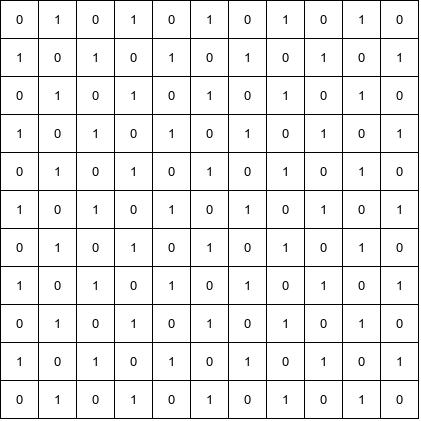

<br> After applying the filter in the horizontal dimension we get 

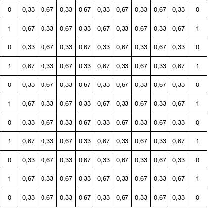

<br> Note that the first and last columns are untouched. A sample calculation for point a(2,2) is 

fx = (1*a(1,2) + 1*a(2,2) + 1*a(3,2))/(1+1+1) = (1 + 0 + 1) / 3 = 0.67 

When we apply the filter in the vertical dimension, we get 

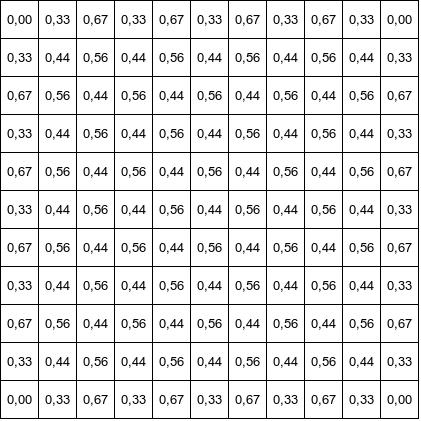 

<br> Again, the filter for pt a(2,2) is given by 

fxy = (1*fx(1,2)+1*fx(2,2) +1*fx(2,3)/(1+1+1) = (0.33 + 0.67 + 0.33) / 3 = 1.33 / 3 = 4/9 = 0.44 

Visualized in color, this gives something like 

Original image 

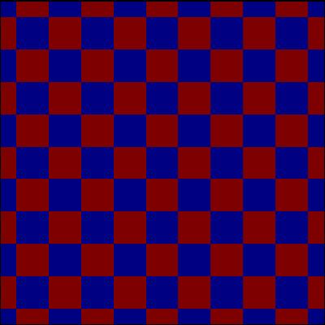

<br> After the (1,1,1) filter 

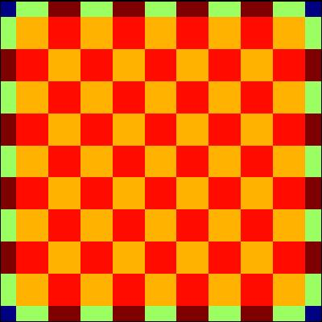

<br> The same filter applied a second time 

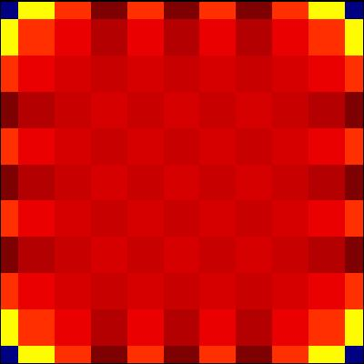

<br> Filter [1,3,1] applied one time 

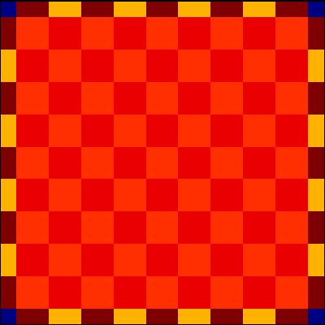

<br> Filter [1,3,1] applied 3 times. 

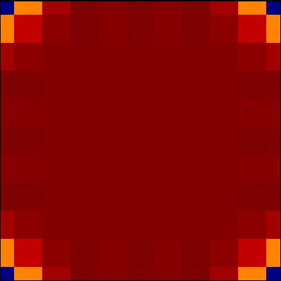

<br> Now let's look at the same filter on precipitation data 

Original field 

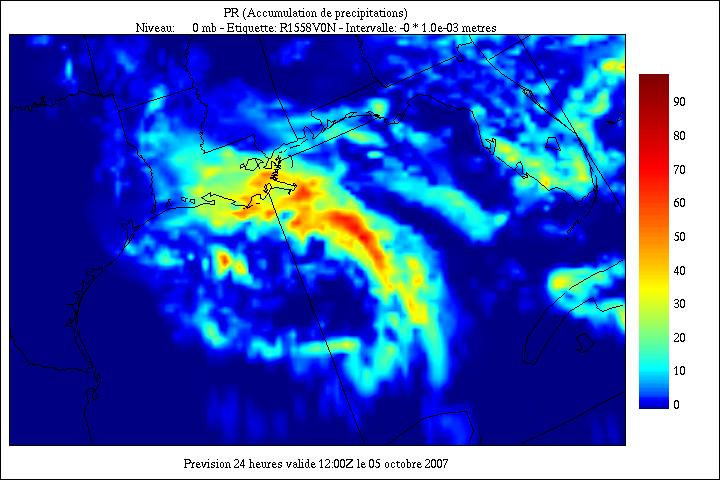

<br> Filter [1,1,1], 1 time 

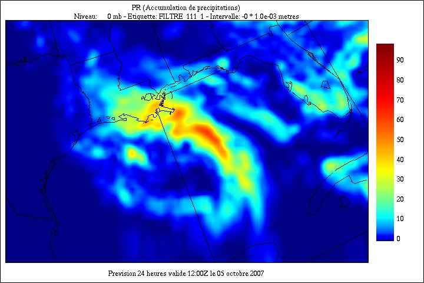

<br> Filter [1,1,1], 2 times 

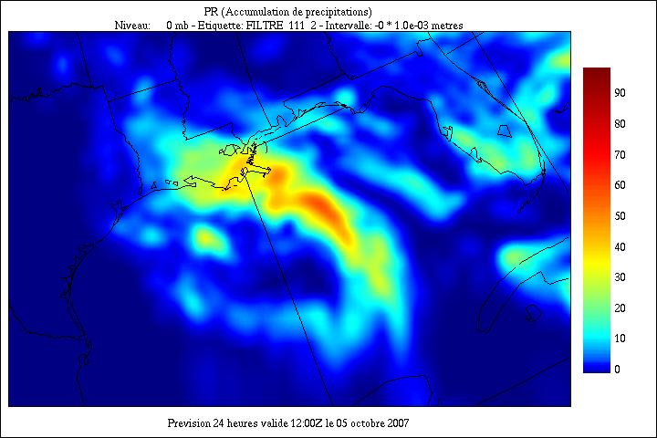

<br> Filter [1,3,1], 1 time 


<br> Filter [1,3,1], 3 times 


---
## CHMPDIF
Reads 2 fields from input file, subtracts the first from the second one, and writes the result in the output file with new values for IP1, IP2, IP3. Name of output field may be changed with namsrt. Either of ip1tab, ip2tab, or ip3tab must consist of an even list of values between square brackets [ ].

### Usage 
```
CHMPDIF(nament,namsrt,ip1tab,ip2tab,ip3tab)
```

| Parameter | Description|
|-----------|------------|
| nament | Name of input field|
| namsrt | Name of output field, defaults to nament|
| ip1tab | Selection criteria for IP1, or even list of IP1 values|
| ip2tab | Selection criteria for IP2, or even list of IP2 values|
| ip3tab | Selection criteria for IP3, or even list of IP3 values| 

Starting with version 6.12, the CHMPDIF directive accepts aggregate floating point levels. So, instead of using the encoded IP1 values for sigma coordinates

```
 chmpdif('GZ', 'DZ', [11950, 11900], 24, 0)
```

the user can enter

```
 chmpdif('GZ', 'DZ', [0.9950, sigma, 0.9900, sigma], 24, 0)
```

Note that if you use this encoding scheme, you should use it for all levels. Actually

```
 chmpdif('GZ', 'DZ', [0.9950, sigma, 11900], 24, 0) 
```

will not work

### Notes 
* It is recommended to write your command scripts in lower case letters.

* If you do wish to write your commands in CAPITAL letters, be careful to start your commands on the 2nd command of the line, otherwise if your command starts with a C and is in the first column, it will be interpreted as a COMMENT. This is a legacy of FORTRAN 66 coding style that was currently used when pgsm was born, near 1980.


---
## MOYENE
Computes the mean value of each grid points for accumulated fields. MOYENE(1.0) must be used for simple mean.

### Usage
```
MOYENE(scal)
```

| Parameter | Description|
|-----------|------------|
| scal | Scaling factor applied to each grid point in accumulator|


---
## MOYENT
Computes meridional mean (North-South, if kind=MER) or zonal mean (East-West, if kind=ZON) of a field from input file, and writes the result in the output file with same arguments as the input records except nj=1.

### Usage 
```
MOYENT(name,kind,lev1,lev2,lev3,....lev30)
```

| Parameter | Description|
|-----------|------------|
| name | Name of input field, ex: 'GZ' or Z|
| MER | Keyword for meridional mean|
| lev1 | Level of input field, IP1 value; up to 30 levels|

* N.B. - Directives TYPESRT, IP3SRT, ETIKSRT must be used if meridional and zonal means are both computed, so that resulting records in output file remain distinct from each other. TYPESRT, IP3SRT, ETIKSRT precede MOYENT.


---
## MOYSTR
Computes meridional mean (North-South, if kind=MER) or zonal mean (East-West, if kind=ZON) of a field from output file, and writes the result in the output file with same arguments as the input records except nj=1.

### Usage 
```
MOYSRT(name,kind,lev1,lev2,lev3,....lev30)
```

| Parameter | Description|
|-----------|------------|
| name | Name of input field, ex: 'GZ' or Z|
| MER | Keyword for meridional mean|
| lev1 | Level of input field, IP1 value; up to 30 levels|

* N.B. - Directives TYPESRT, IP3SRT, ETIKSRT must be used if meridional and zonal means are both computed, so that resulting records in output file remain distinct from each other. TYPESRT, IP3SRT, ETIKSRT precede MOYSRT.


---
## LIREE
Reads a field from an input standard file. The field is saved in an accumulator, for later use in operations through the directives PLUSE, PLUSS, MOINSE, MOINSS, MODUL2E, MODUL2S and ECRITS.

* N.B. It must be preceded by directive SORTIE. This directive cannot be used with sequential files.

### Usage 
```
LIREE(namevar,typvar,date,ip1,ip2,ip3,etiket)
```

| Parameter | Description|
|-----------|------------|
| namevar | Field name, 2 characters left justified or valid equivalent.
| typvar | Type of field, one character left justified, usually A or P.
| date | CMC date-time stamp obtained with **r.date**, 9 digit integer.
| ip1 | Level, either encoded (500 = 500 mb) or level value and type ([1.0, sigma])</br>For more details please consult the documentation of the [CHAMP](#champ) directive|
| ip2 | Time period, ex: 36 = 36 hour forecast. Max = 32767.
| ip3 | If ip3=COMTEUR then ip3 is set by pgsm to the number of fields accumulated in temporary file.
| etiket | Label, 12 characters left justified. Ex: 'F050B25N'. 


---
## LIRES
Reads a field from an output standard file. The field is saved in an accumulator, for later use in operations through the directives PLUSE, PLUSS, MOINSE, MOINSS, MODUL2E, MODUL2S and ECRITS.

* N.B. It must be preceded by directive SORTIE. This directive cannot be used with sequential files.

### Usage
```
LIRES(namevar,typvar,date,ip1,ip2,ip3,etiket)
```

| Parameter | Description|
|-----------|------------|
| namevar | Field name, 2 characters left justified or valid equivalent|
| typvar | Type of field, one character left justified, usually A or P|
| date | CMC date-time stamp obtained with **r.date**, 9 digit integer|
| ip1 | Level, either encoded (500 = 500 mb) or level value and type ([1.0, sigma])</br>For more details please consult the documentation of the [CHAMP](#champ) directive|
| ip2 | Time period, ex: 36 = 36 hour forecast. Max = 32767|
| ip3 | If ip3=COMTEUR then ip3 is set by pgsm to the number of fields accumulated in temporary file|
| etiket | Label, 12 characters left justified. Ex: 'F050B25N'|


---
## PLUSE
Reads all identical fields from and input standard file and adds them to the content of the accumulator grid point to grid point. The result in saved in the accumulator. It must be preceded by LIREE or LIRES. Directive ONCE=OUI, or UNEFOIS=OUI, must precede PLUSE if only one record is desired.

### Usage 
```
PLUSE(namevar,typvar,date,ip1,ip2,ip3,etiket)
```

| Parameter | Description|
|-----------|------------|
| namevar | Field name, 2 characters left justified or valid equivalent|
| typvar | Type of field, one character left justified, usually A or P|
| date | CMC date-time stamp, 10 digit integer WMMDDYYZZR|
| ip1 | Level, either encoded (500 = 500 mb) or level value and type ([1.0, sigma])</br>For more details please consult the documentation of the [CHAMP](#champ) directive|
| ip2 | Time period, ex: 36 = 36 hour forecast. Max = 32767|
| ip3 | If ip3=COMTEUR then ip3 is set by pgsm to the number of fields accumulated in temporary file|
| etiket | Label, 8 characters left justified. Ex: 'F050B25N'|


---
## PLUSS
Reads all identical fields from and output standard file and adds them to the content of the accumulator grid point to grid point. The result in saved in the accumulator. It must be preceded by LIREE or LIRES. Directive ONCE=OUI, or UNEFOIS=OUI, must precede PLUSE if only one record is desired.

### Usage 
```
PLUSS(namevar,typvar,date,ip1,ip2,ip3,etiket)
```

| Parameter | Description|
|-----------|------------|
| namevar | Field name, 2 characters left justified or valid equivalent|
| typvar | Type of field, one character left justified, usually A or P|
| date | CMC date-time stamp, 10 digit integer WMMDDYYZZR|
| ip1 | Level, either encoded (500 = 500 mb) or level value and type ([1.0, sigma])</br>For more details please consult the documentation of the [CHAMP](#champ) directive|
| ip2 | Time period, ex: 36 = 36 hour forecast. Max = 32767|
| ip3 | If ip3=COMTEUR then ip3 is set by pgsm to the number of fields accumulated in temporary file|
| etiket | Label, 8 characters left justified. Ex: 'F050B25N'|


---
## MOINSE
Reads a field from an input standard file and subtracts the content from the accumulator, grid point to grid point. The result is saved in the accumulator. This directive must be preceded by LIREE or LIRES.

### Usage 
```
MOINSE(namevar,typvar,date,ip1,ip2,ip3,etiket)
```

| Parameter | Description|
|-----------|------------|
| namevar | Field name, 2 characters left justified or valid equivalent|
| typvar | Type of field, one character left justified, usually A or P|
| date | CMC date-time stamp, 10 digit integer WMMDDYYZZR|
| ip1 | Level, either encoded (500 = 500 mb) or level value and type ([1.0, sigma])</br>For more details please consult the documentation of the [CHAMP](#champ) directive|
| ip2 | Time period, ex: 36 = 36 hour forecast. Max = 32767|
| ip3 | If ip3=COMTEUR then ip3 is set by pgsm to the number of fields accumulated in temporary file|
| etiket | Label, 8 characters left justified. Ex: 'F050B25N'|


---
## MOINSS
Reads a field from an output standard file and subtracts the content from the accumulator, grid point to grid point. The result is saved in the accumulator. This directive must be preceded by LIREE or LIRES.

### Usage 
```
MOINSS(namevar,typvar,date,ip1,ip2,ip3,etiket)
```

| Parameter | Description|
|-----------|------------|
| namevar | Field name, 2 characters left justified or valid equivalent|
| typvar | Type of field, one character left justified, usually A or P|
| date | CMC date-time stamp, 10 digit integer WMMDDYYZZR|
| ip1 | Level, either encoded (500 = 500 mb) or level value and type ([1.0, sigma])</br>For more details please consult the documentation of the [CHAMP](#champ) directive|
| ip2 | Time period, ex: 36 = 36 hour forecast. Max = 32767|
| ip3 | If ip3=COMTEUR then ip3 is set by pgsm to the number of fields accumulated in temporary file|
| etiket | Label, 8 characters left justified. Ex: 'F050B25N'|


---
## LIRMODE
Reads a field from an input standard file, computes the square of each grid point and adds it to the content of the accumulator, grid point to grid point. ip3 can be used a register to keep track of the number of fields accumulated. It must be preceded by directive SORTIE(...,...,...). Standard sequential files cannot be read this way.

### Usage 
```
LIRMODE(namevar,typvar,date,ip1,ip2,ip3,etiket)
```

| Parameter | Description|
|-----------|------------|
| namevar | Field name, 2 characters left justified or valid equivalent|
| typvar | Type of field, one character left justified, usually A or P|
| date | CMC date-time stamp, 10 digit integer WMMDDYYZZR|
| ip1 | Level, either encoded (500 = 500 mb) or level value and type ([1.0, sigma])</br>For more details please consult the documentation of the [CHAMP](#champ) directive|
| ip2 | Time period, ex: 36 = 36 hour forecast. Max = 32767|
| ip3 | If ip3=COMTEUR then ip3 is set by pgsm to the number of fields accumulated in temporary file|
| etiket | Label, 8 characters left justified. Ex: 'F050B25N'|


---
## LIRMODS
Reads a field from an output standard file, computes the square of each grid point and adds it to the content of the accumulator, grid point to grid point. ip3 can be used a register to keep track of the number of fields accumulated. It must be preceded by directive SORTIE(...,...,...). Standard sequential files cannot be read this way.

### Usage 
```
LIRMODS(namevar,typvar,date,ip1,ip2,ip3,etiket)
```

| Parameter | Description|
|-----------|------------|
| namevar | Field name, 2 characters left justified or valid equivalent|
| typvar | Type of field, one character left justified, usually A or P|
| date | CMC date-time stamp, 10 digit integer WMMDDYYZZR|
| ip1 | Level, either encoded (500 = 500 mb) or level value and type ([1.0, sigma])</br>For more details please consult the documentation of the [CHAMP](#champ) directive|
| ip2 | Time period, ex: 36 = 36 hour forecast. Max = 32767|
| ip3 | If ip3=COMTEUR then ip3 is set by pgsm to the number of fields accumulated in temporary file|
| etiket | Label, 8 characters left justified. Ex: 'F050B25N'|


---
## MODUL2E
Reads a field from an input standard file and adds the square of each grid point to the accumulator. The result is saved in the accumulator. This directive must be preceded by LIREE or LIRES.

```
MODUL2E(namevar,typvar,date,ip1,ip2,ip3,etiket)
```

| Parameter | Description|
|-----------|------------|
| namevar | Field name, 2 characters left justified or valid equivalent|
| typvar | Type of field, one character left justified, usually A or P|
| date | CMC date-time stamp, 10 digit integer WMMDDYYZZR|
| ip1 | Level, either encoded (500 = 500 mb) or level value and type ([1.0, sigma])</br>For more details please consult the documentation of the [CHAMP](#champ) directive|
| ip2 | Time period, ex: 36 = 36 hour forecast. Max = 32767|
| ip3 | If ip3=COMTEUR then ip3 is set by pgsm to the number of fields accumulated in temporary file|
| etiket | Label, 8 characters left justified. Ex: 'F050B25N'|


---
## MODUL2S
Reads a field from an output standard file and adds the square of each grid point to the accumulator. The result is saved in the accumulator. This directive must be preceded by LIREE or LIRES.

```
MODUL2S(namevar,typvar,date,ip1,ip2,ip3,etiket)
```

| Parameter | Description|
|-----------|------------|
| namevar | Field name, 2 characters left justified or valid equivalent|
| typvar | Type of field, one character left justified, usually A or P|
| date | CMC date-time stamp, 10 digit integer WMMDDYYZZR|
| ip1 | Level, either encoded (500 = 500 mb) or level value and type ([1.0, sigma])</br>For more details please consult the documentation of the [CHAMP](#champ) directive|
| ip2 | Time period, ex: 36 = 36 hour forecast. Max = 32767|
| ip3 | If ip3=COMTEUR then ip3 is set by pgsm to the number of fields accumulated in temporary file|
| etiket | Label, 8 characters left justified. Ex: 'F050B25N'|


---
## FOISE
Reads a field from an input standard file and multiplies it with the accumulator, grid point to grid point. The result is saved in the accumulator. This directive must be preceded by LIREE or LIRES. 

```
FOISE(namevar,typvar,date,ip1,ip2,ip3,etiket)
```

| Parameter | Description|
|-----------|------------|
| namevar | Field name, 2 characters left justified or valid equivalent|
| typvar | Type of field, one character left justified, usually A or P|
| date | CMC date-time stamp, 10 digit integer WMMDDYYZZR|
| ip1 | Level, either encoded (500 = 500 mb) or level value and type ([1.0, sigma])</br>For more details please consult the documentation of the [CHAMP](#champ) directive|
| ip2 | Time period, ex: 36 = 36 hour forecast. Max = 32767|
| ip3 | If ip3=COMTEUR then ip3 is set by pgsm to the number of fields accumulated in temporary file|
| etiket | Label, 8 characters left justified. Ex: 'F050B25N'|

---
## FOISS
Reads a field from an output standard file and multiplies it with the accumulator, grid point to grid point. The result is saved in the accumulator. This directive must be preceded by LIREE or LIRES. 

```
FOISS(namevar,typvar,date,ip1,ip2,ip3,etiket)
```

| Parameter | Description|
|-----------|------------|
| namevar | Field name, 2 characters left justified or valid equivalent|
| typvar | Type of field, one character left justified, usually A or P|
| date | CMC date-time stamp, 10 digit integer WMMDDYYZZR|
| ip1 | Level, either encoded (500 = 500 mb) or level value and type ([1.0, sigma])</br>For more details please consult the documentation of the [CHAMP](#champ) directive|
| ip2 | Time period, ex: 36 = 36 hour forecast. Max = 32767|
| ip3 | If ip3=COMTEUR then ip3 is set by pgsm to the number of fields accumulated in temporary file|
| etiket | Label, 8 characters left justified. Ex: 'F050B25N'|


---
## ECRITS
Writes the content of the accumulator in the output standard file. The value -1 given to an argument will result in the default value, or the value for the last input field, being used.

### Usage 
```
ECRITS(namevar,npack,date,ip1,ip2,ip3,typvar,etiket,grtyp,IMPRIM)
```

| Parameter | Description|
|-----------|------------|
| namevar | Field name, 2 characters left justified or valid equivalent|
| npack | Density in bits per grid point, default is -16, i.e. 16 bits|
| date | CMC date-time stamp, 10 digit integer WMMDDYYZZR|
| ip1 | Level, either encoded (500 = 500 mb) or level value and type ([1.0, sigma])</br>For more details please consult the documentation of the [CHAMP](#champ) directive|
| ip2 | Time period, ex: 36 = 36 hour forecast. Max = 32767|
| ip3 | If ip3=COMTEUR then ip3 is set by pgsm to the number of fields accumulated|
| typvar | Type of field, one character left justified, usually A or P|
| etiket | Label, 8 characters left justified. Ex: 'F050B25N'|
| grtyp | Obsolete. Value ignored|
| IMPRIM | Will print arguments of LIREE/LIRES and ECRITS in diagnostic output file|


---
## PFOIS
Adds an offset to each point in accumulator, multiplies it by fact and divides it by divi.

### Usage 
```
PFOIS(offset,fact,divi)
```

| Parameter | Description|
|-----------|------------|
| offset | Real value added to each point of the accumulator|
| fact | Real value to multiply each point|
| divi | Real value to divide each point|


---
## RACINE
Extracts the square root of each point in the accumulator and multiplies it by fact.

### Usage 
```
RACINE(fact)
```

| Parameter | Description|
|-----------|------------|
| fact | Real value to multiply each point|


---
## EXPON
Computes the exponential function of each point in the accumulator and multiplies it by fact. 

### Usage 
```
EXPON(fact)
```

| Parameter | Description|
|-----------|------------|
| fact | Real value to multiply each point|


---
## ALOGN
Computes the logarithm of each point in the accumulator and multiplies it by fact

### Usage 
```
ALOGN(fact)
```

| Parameter | Description|
|-----------|------------|
| fact | Real value to multiply each point|


---
## UNEFOIS
To read only one record with PLUSE/PLUSS. Must precede PLUSE/PLUSS.

### Usage
```
UNEFOIS=OUI [NON]
```


---
## ONCE
To read only one record with PLUSE/PLUSS. Must precede PLUSE/PLUSS.

### Usage
```
ONCE=OUI
```

---
# Tracing input/output value of fields

## PRINTEN
 Lists the input field in the diagnostic output file using a format 10E13.5. Sets the printing option. Must precede CHAMP.

### Usage 
```
PRINTEN=[OUI/NON],nis,njs,nif,njf,ninc,njnc
```

| Parameter | Description|
|-----------|------------|
| OUI / NON | Turns on/off the printing option|
| nis | First value of East-West index (grid points). (X) (I)|
| njs | First value of North-South index. (Y) (J)|
| nif | Last value of East-West index. (X) (I)|
| njf | Last value of North-South index. (Y) (J)|
| ninc | East-West increment in grid points. (X) (I)|
| njnc | North-South increment in grid points. (Y) (J) |

* N.B. PRINTEN=OUI prints all values of the field. Remains in effect until PRINTEN=NON.


---
## PRINTSR
 Lists the output field in the diagnostic output file using a format 10E13.5. Sets the printing option. Must precede CHAMP.

### Usage 
```
PRINTSR=[OUI/NON],nis,njs,nif,njf,ninc,njnc
```

| Parameter | Description|
|-----------|------------|
| OUI / NON | Turns on/off the printing option|
| nis | First value of East-West index (grid points). (X) (I)|
| njs | First value of North-South index. (Y) (J)|
| nif | Last value of East-West index. (X) (I)|
| njf | Last value of North-South index. (Y) (J)|
| ninc | East-West increment in grid points. (X) (I)|
| njnc | North-South increment in grid points. (Y) (J) |

* N.B. PRINSR=OUI prints all values of the field. Remains in effect until PRINTSR=NON.


---
# Interpolation and extrapolation control

## PAIRES
Defines a new pair of variables to be interpolated as a vector field.

This command has two modes of operation. 
The first mode(3 arguments, ends by 0) interpolates vectorially 2 variables and writes them in the output file, keeping the same convention. 'VEC_X' is the X-component of the field, 'VEC_Y' the Y-component. 

The second mode (4 or 5 arguments) interpolates vectorially 2 variables, but writes them as wind modulus and direction. 

### Usage
```
PAIRES('KEY','VEC_X','VEC_Y', 0)
PAIRES('KEY','VEC_X','VEC_Y', 'MODULUS')
PAIRES('KEY','VEC_X','VEC_Y', 'MODULUS', 'WIND_DIR')
```

| Parameter | Description|
|-----------|------------|
| KEY      | Name of the pair, user defined, to be used in CHAMP|
| VEC_X    | Name of the first field of the pair|
| VEC_Y    | Name of the second field of the pair|
| MODULUS  | Modulus of the vector variable|
| WIND_DIR | Meteorological wind direction of the vector field (in degrees). North wind = 0 deg, East wind = 90, South wind = 180, West wind= 270 deg|

* If the 4th argument is 0, variables VEC_X and VEC_Y are interpolated as a vector and written as is. If "MODULUS" and "WIND_DIR" are defined, then VEC_X and VEC_Y are interpolated but they are transformed into "MODULUS" and "WIND_DIR".

* N.B. Must precede CHAMP. Initialized pairs: PAIRES( 'UV','UU','VV',0)

### Examples
```
PAIRES('UV','UU','VV', 0)
```
* if CHAMP(UV, ...) is invoked, fields UU and VV are read, vectorially interpolated and written as UU and VV in the output file.

```
PAIRES('VENT','UU','VV','UV')
```
* if CHAMP(VENT, ...) is invoked, fields UU and VV are read and vectorially interpolated. The modulus of the wind (UV) is written in the output file.

```
PAIRES('UVS' ,'US','VS',0)
```
* if CHAMP(UVS, ...) is invoked, fields US and VS are read, vectorially interpolated and written as US and VS on the target grid.

```
PAIRES('MOD_UVS' ,'US' ,'VS' ,'UVSS')
```
* if CHAMP(MOD_UVS, ...) is invoked, fields US and VS are read and vectorially interpolated. The modulus of the wind (UVSS) is written in the output file.

```
PAIRES('WIND_UVS','US' ,'VS' ,'UVSS','WDSS')
```
* if CHAMP(WIND_UVS, ...) is invoked, fields UU and VV are read and vectorially interpolated. The modulus of the wind (UVSS) and the wind direction (WDSS) are written in the output file.


---
## METSYM
Determines whether a field should be considered as symmetrical (OUI), or antisymmetrical (NON) for interpolation purposes. By default, all fields are assumed to be symmetrical but one, 'VV'.

### Usage 
```
METSYM(namevar,OUI/NON)
```

| Parameter | Description|
|-----------|------------|
| namevar | Field name, 2 characters or valid equivalent|
| OUI/NON | Field will be considered symmetrical / antisymmetrical|


---
## SETINTX
Sets interpolation mode. Must precede CHAMP. Remains effective through the execution of pgsm or until another SETINTX is met.

### Usage 
```
SETINTX(VOISIN/LINEAIR/CUBIQUE) [CUBIQUE]
```

- VOISIN : Interpolated value at one point will be that of the nearest grid point from input file.
- LINEAIR : Bi-linear interpolation.
- CUBIQUE : Bi-cubic interpolation.
- MOYENNE : Aggregation to a lower resolution target grid.  ('''NOTE''' that this option only works when both the source and target grids are LATLON.)


---
## EXTRAP
Sets extrapolation mode when the output grid exceeds the limits of the grid on the input file. 'value' can be

### Usage
```
EXTRAP(value) [CUBIQUE]
```

- VOISIN : The nearest neighbor value will be used.
- LINEAIR : Linear extrapolation.
- CUBIQUE : Cubic extrapolation.
- MINIMUM : Minimum value of field minus 25% of max-min dynamic spread.
- MAXIMUM : Maximum value of field plus 25% of max-min dynamic spread.
- real : Real number such as 0.0 or 540.0.


---
# Numerical precision control

## COMPRESSION
Defines the compaction factor (number of bits) used in the output field (NPAK).

### Usage
```
COMPRESS=OUI/NON for lossless compression 
```

Note: default for output is non-compressed (even if input is compressed)


---
## COMPAC
Data compression in output file. Must precede CHAMP. 

### Usage
COMPAC=npack 

* npack - Compression factor; 
   * npack=0 or 1 : no compression   
   * npack > 1 : compression ratio (deprecated) 
   * npack <0 : will save ABS(npack) bits per grid point. 

* Examples 
   * compac=0 (datyp=0, nbits = 32, X32, memory dump) 
   * compac=1 (datyp=5, nbits = 32, X32, memory dump) 
   * compac=4 (datyp=1 (real), nbits=32/4=8) 
   * compac=8 (datyp=1 (real), nbits=32/8=4) 
   * compac=-16 (datyp=1 (real), nbits=16) 
   * compac=-24 (datyp=1 (real), nbits=24)

Note: with COMPAC=0, the output is a memory dump, regardless of the input precision. Here is an example with COMPAC=0: 
```
 Read(1) LG   A  RSGEM53N      1080   540     1  359892800 0 0     0        0        0  R16  G     0     0     0     0
 Write(2) LG   P@ RSGEM53N      4322  3059     1  359892800 0 0     0        0        0  X32  Y  1001  1002  1003     0
```

The datyp of the output field is X32, a type not easily compressible using fstcompres. To store the output field in E32 IEEE native floating point point format, use 
```
 compac=-32
```
To have the same output precision as input, just use this command. 
```
 compac=origin
```


---
## FORMAT
This command is used set the format of the printed values, as one would use the FORMAT statement in a FORTRAN program. The f,g and e formats can be used.The following are valid format commands.
### Usage
```
FORMAT('FORTRAN format')
```

### Example
```
format('f10.3')
format('e10.3')
format('g16.5')
```


---
# Output field scaling

## CONV
Adds a uniform value to a field, multiplies the result by a given factor and sets upper and lower bounds of the output field. Must precede CHAMP, or LIREE and ECRITS.

### Usage
```
CONV(namevar,offset,fact [,min,max])
```

| Parameter | Description|
|-----------|------------|
| namevar | Field name, 2 characters or valid equivalent|
| offset | Real value to be added to the field at each grid point|
| fact | Real value to multiply the field at each grid point|
| min | Real value before conversion to replace all values lower than min. Optional|
| max | Real value before conversion to replace all values higher than max. Optional|


* The CONV command will not operate with CHAMP command when datyp of input field represent integers (i.e. datyp=2, 4, 130 or 132). In this situation, use LIREE and ECRITS instead of CHAMP and CONV will work as expected.

### Example
The following will not work if MG has datyp=2
```
 ...
 CONV('MG',-1.,10000.0)
 CHAMP('MG')
 ...
```
This will work if MG has datyp=2
```
 ...
 CONV('MG',-1.,10000.0)
 LIREE('MG',' ',-1,-1,-1,-1,'            ')
 ECRITS('MG',-16,-1,0,0,0,-1,-1,-1,non)
 ...
```


---
# Diagnostic level control

## ECHO
This command is used to print messages or comments in the output file.

### Usage
```
ECHO('STRING')
```

### Example
```
echo('Precipitation for the Montreal area')
```

---
# MESSAGE
Toggle to increase/decrease diagnostic messages.

### Usage 
```
MESSAGE=OUI/NON [OUI]
```

- OUI : Lists all messages in diagnostic output file.
- NON : Lists only important messages in diagnostic output file.


---
# Latlon output

## OUTLALO
Writes a record of latitudes and a record of longitudes in output file, with given values of IP1, IP2, and IP3.

### Usage 
```
OUTLALO(IP1,IP2,IP3 [,namlat,namlon,grtyp,etiklat,etiklon])
```

| Parameter | Description|
|----------|------------|
| IP1 | 0=< IP1 < 32768, reference value to access coordinates records|
| IP2 | 0=< IP2 < 32768, reference value to access coordinates records|
| IP3 | 0=< IP3 < 4096, reference value to access coordinates records|
| namlat | Name of latitude record, defaults to '^^' or 'LA'|
| namlon | Name of longitude record, defaults to '>>' or 'LO'|
| grtyp | Grid type, one character|
| etiklat | Label for latitude, 8 characters, default='NORD-SUD'|
| etiklon | Label for longitude, 8 characters, default='ESTOUEST'|


---
# Navigational records creation

## COORD
This command is used to create on-the-fly navigational latlon records. These records can be written to a standard file (if the output file type is an RPN standard file), or can be used to specify at which latlon coordinates one want to interpolate data (if the output file type is formatted)The maximum number of coordinates that can be entered this way is 512.

Note that the length of the command cannot exceed 80 characters. To enter more coordinates,use the COORD command multiple times.

### Usage
```
COORD([lat1,lon1,lat2,lon2,lat3,lon3...], add/reset)
```

```
coord([lat1,lon1,lat2,lon2,lat3,lon3...], add)
coord([lat4,lon4,lat5,lon5,lat6,lon6...], add)
coord([lat7,lon7,lat8,lon8,lat9,lon9...], add)
coord([lat10,lon10,lat11,lon11,lat12,lon12...], add)
```

* Using '''reset''' instead of '''add''' will reinitialize the counter to zero.One the coordinates have been entered, the user must use the '''grille''' command using '''stations''' as grid type to interpolate at the latlon coordinates defined in the suite of '''coord''' commands.

```
grille(stations,ip1,ip2,ip3)
```

* where ip1,ip2 and ip3 are record identifiers chosen by the user.